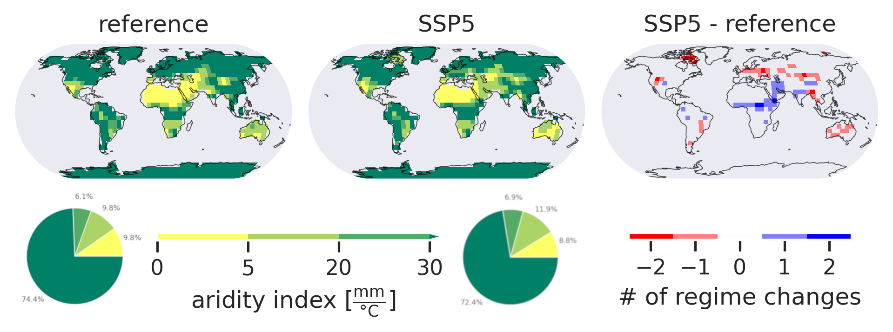

# Impact of Increasing Atmospheric CO2 Concentration on Global Temperature & Precipitation

This analysis quantifies the increase in global mean temperature depending on atmospheric
CO2 concentration using [PlaSim](https://www.mi.uni-hamburg.de/en/arbeitsgruppen/theoretische-meteorologie/modelle/plasim.html) data. Not only temperature, but also annual precipitation
sum is going to increase in high CO2 concentration scenarios. This change is not spatially uniform,
but closely follows the global atmospheric circulation pattern.
By implementing a moisture regime classification (see figure below),
we identify regions experiencing severe alternations in water availability,
which is probably most challenging for future generations. Further information is available in the written [report](report/report.pdf).

This project is part of the lecture series *Climate Variability & Models* at FU Berlin.
